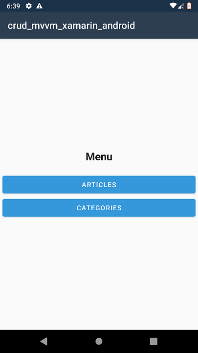
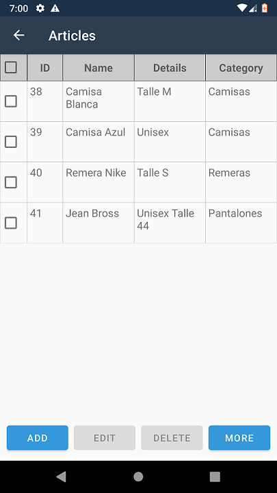
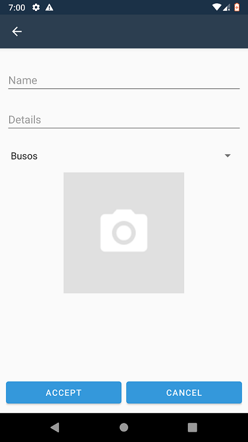
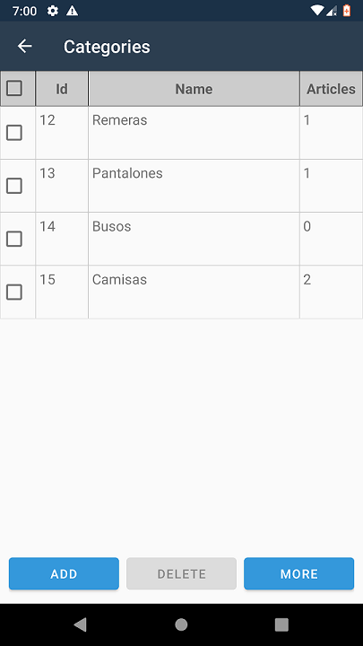

# Crud MVVM Xamarin Android

Sistema básico tipo CRUD hecho en C# con Xamarin Android y base de 
datos SQLite.

## ¿De qué trata esta aplicación?

Este proyecto consiste en un pequeño sistema de inventario conformado
por artículos y agrupados por categoría.

## Librerías usadas

Backend
- [sqlite-net-pcl](https://www.nuget.org/packages/sqlite-net-pcl/)
- [Xamarin.Forms](https://www.nuget.org/packages/xamarin.forms/)

Frontend
- [Xarin.Google.Android.Material](https://www.nuget.org/packages/Xamarin.Google.Android.Material/)

## ¿Cómo pruebo esto? - (ejecución de APK)

1. En **Visual Studio IDE** ir a → **Compilar** → **Archivar** (cambiar 
a modo "Release", en modo "Debug" puede dar errores) → luego en la 
sección de **Archive Manager** en **Solución actual** debería empezar a
crearse el APK (puede tardar unos minutos).

2. Una vez creado el APK vamos a → **Distribuir**, luego → **Ad hoc**
seleccionamos la aplicación → **Guardar como...**, le damos un nombre al
.apk → luego saldrá un cuadro donde poner nuestra contraseña para firmar
el APK.

3. Abrimos el directorio donde guardamos la aplicación, copiamos el 
APK al móvilo e instalamos.

**NOTA: Para ver un paso a paso más detallado acerca de como desplegar 
una aplicación Xamarin para Android ver [este enlace](https://github.com/manuel-chinchi/notes-dev)**

## Capturas

	<table style="display: inline-table; width: 100%">
		<!-- <caption>table title and/or explanatory text</caption> -->
		<thead>
			<tr>
				<th>Pantalla</th>
				<th>Descripción</th>
			</tr>
		</thead>
		<tbody>
			<tr>
				<td>
					 
					

						
					

					 			
				</td>
				<td>
					
Menú principal

				</td>
			</tr>
			<tr>
				<td>
					 
					

						
					

					 		
				</td>
				<td>
					
Lista de artículos

				</td>
			</tr>
			<tr>
				<td>
					 
					

						
					

					 
				</td>
				<td>
					
Formulario crear artículo

				</td>
			</tr>
			<tr>
				<td>
					 
					

						
					

					 
				</td>
				<td>
					
Lista de categorías

				</td>
			</tr>
		</tbody>
	</table>	

## Plataformas soportadas

Android 11 o superior

## Referencias

* [optimizar apps de Xamarin.Android ](https://devblogs.microsoft.com/xamarin/optimize-xamarin-android-builds/)
* [patrones de diseño](https://en.wikipedia.org/wiki/Software_design_pattern)
* [usar patron MVP en Xamarin.Android](https://blog.kloud.com.au/2018/01/17/xamarin-application-architecture/)
* [free icons](https://icon.kitchen/)
* [FileProvider Xamarin.Android](https://stackoverflow.com/questions/52657374/how-to-add-fileprovider-xml-file-in-xamarin-android)
* [FileProvider Xamarin.Android](https://stackoverflow.com/questions/74632778/xamarin-android-fileprovider-geturiforfile-system-nullreferenceexception)
* [obtener item seleccionado de galeria en Android](https://stackoverflow.com/questions/55740441/how-to-get-selected-image-name-from-gallery-in-xamarin-android)
* [configure IOs hosted device](https://www.youtube.com/watch?v=Llqlcp0So0A)
* [tomar foto y guardar en dispositivo - Android 11 API 30 Xamarin.Essentials](https://stackoverflow.com/questions/69354298/android-11-api-30-with-xamarin-essentials-take-photo-and-save-to-device)
* [baja calidad en camara](https://stackoverflow.com/questions/75055439/xamarin-android-image-capture-by-camera-using-intent-actionimagecapture-the-ima)
* [barra de accion es null](https://stackoverflow.com/questions/28740183/xamarin-tab-causes-system-nullreferenceexception)
* [patron MVVM en Xamarin](https://softwarecrafters.io/xamarin/patron-mvvm-xamarin-forms)
* [patron MVVM en Xamarin (2)](https://www.codeproject.com/Tips/5252643/MVVM-and-Xamarin-Forms)
* [binding en Xamarin.Android](https://stackoverflow.com/questions/32242965/android-data-binding-library-in-xamarin-android)
* [binding en Xamarin.Android (2)](https://stackoverflow.com/questions/75456495/how-to-build-binding-class-in-xamarin-android)
* [binding en Xamarin](https://stackoverflow.com/questions/62146033/xamarin-binding-class-property)
* [ObservableCollection use in c#](https://stackoverflow.com/questions/4279185/what-is-the-use-of-observablecollection-in-net) 